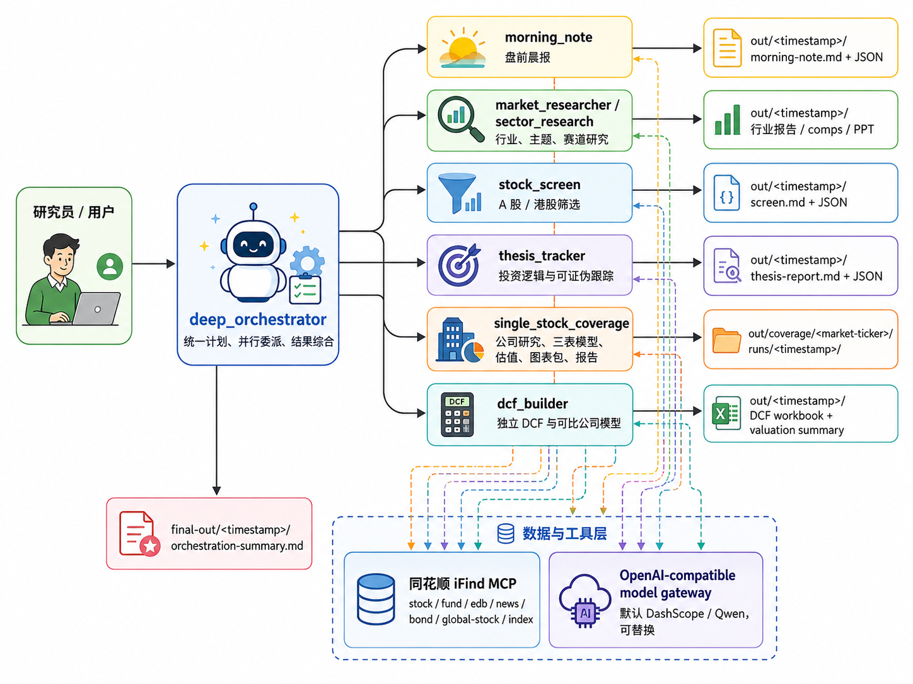

# Deep Financial Analysis

[中文主页](README.md)

A multi-agent research system for China public markets. It connects pre-market intelligence, sector research, stock screening, single-stock research, three-statement modeling, DCF valuation, and chart packs into a local, auditable workflow.



> Disclaimer: this project produces research workpapers and analytical materials. It does not provide investment advice. Outputs should be reviewed by qualified professionals before use.

## 1. What This Project Is

`Deep Financial Analysis` is designed as a local equity-research workflow system for China public markets. It decomposes research work into specialized agents and lets them collaborate around one research task.

It currently covers:

- Morning notes: overnight markets, policy, announcements, capital flows, and trading ideas
- Sector research: value chain, competitive landscape, key stocks, and risk variables
- Stock screening: A-share / HK thematic screens, factor screens, and watchlists
- Single-stock research: company profile, business model, cost structure, governance, moat, and risks
- Financial modeling and valuation: three-statement model, model audit, DCF, comps, and valuation reconciliation
- Charts and reports: chart packs, PPT/Markdown research materials, and final synthesis reports

The data layer is built around Tonghuashun iFind MCP. Model calls go through an OpenAI-compatible gateway, with DashScope/Qwen as the default and replaceable backend.

## 2. What It Produces

| Output | Description |
|---|---|
| `morning-note.md` | A-share pre-market briefing covering global markets, commodities, FX, policy, company events, and flows |
| Sector / thematic reports | Supply-demand, value chain, competitive landscape, A-share targets, catalysts, and risks |
| Stock screens | Candidate stocks and watchlists driven by themes, factors, flows, or events |
| Single-stock research | Company identity, business breakdown, profit drivers, governance, moat, and risks |
| `integrated_model.xlsx` | Linked three-statement model, revenue build, working capital, PP&E, debt, and DCF inputs |
| Valuation analysis | DCF, trading comps, historical multiples, market-implied checks, valuation reconciliation, and scenarios |
| Chart packs | Football field, sensitivity analysis, scenario comparison, risk matrix, catalyst timeline, and more |

## 3. Public Examples

The following three examples represent the system's current core capabilities and are directly readable on GitHub:

| Example | Link | Capability |
|---|---|---|
| Morning note | [A-share Morning Note](docs/examples/a-share-morning-note.md) | Overnight markets, policy, announcements, capital flows, and trading themes |
| Sector research | [MLCC sector research](docs/examples/mlcc-sector-research.md) | Supply-demand, value chain, competitive landscape, key stocks, and risks |
| Single-stock research | [Shaanxi Coal company research](docs/examples/shaanxi-coal-company-research.md) | Business model, cost structure, governance, moat, and risks |

## 4. Design Positioning: Compared With Anthropic Financial Agents

On May 5, 2026, Anthropic released ten ready-to-run financial-services agent templates for investment banking, asset management, finance, and compliance workflows. See [Agents for financial services](https://www.anthropic.com/news/finance-agents) and [anthropics/financial-services](https://github.com/anthropics/financial-services).

Anthropic's agents are positioned closer to an enterprise financial-workflow template marketplace: pitch builder, meeting preparer, earnings reviewer, market researcher, model builder, valuation reviewer, statement auditor, KYC screener, and related workflows.

`Deep Financial Analysis` starts from a different premise. It is organized around China public-market research rather than a general collection of financial skills.

| Dimension | Anthropic Financial Agents | Deep Financial Analysis |
|---|---|---|
| Positioning | General financial-services agent templates | China public-market research production system |
| Platform | Claude Cowork, Claude Code plugin, or Managed Agents | Python, LangGraph, local files, and replaceable model gateway |
| Market | Broad global financial workflows | Native A-share, HK, Chinese ADR, China macro, announcements, northbound/southbound, ETF, Dragon-Tiger List, futures, and earnings-season context |
| Data | Overseas financial connectors and enterprise data | Tonghuashun iFind MCP for stocks, funds, macro, news, bonds, global equities, and indices |
| Logic | Skills and workflow templates | Morning note -> sector/theme -> screen -> single-stock research -> model -> valuation -> charts/report |
| Outputs | Enterprise review and Office workflows | Markdown, JSON, Excel, PPT, PNG charts, and synthesis reports |
| Auditability | Platform logs | Local artifacts: source logs, run manifests, model audits, valuation states |

In short: Anthropic is strong at general enterprise financial templates; this project is built for complete local China equity research workflows.

## 5. Configuration

Requirements:

- Python 3.11
- OpenAI-compatible model gateway, defaulting to `https://dashscope.aliyuncs.com/compatible-mode`
- Tonghuashun iFind MCP token or raw Authorization header

Install:

```bash
python3.11 -m venv .venv
. .venv/bin/activate
pip install -U pip
pip install -e ./DCF-builder -e ./industry-ananlysis -e ./morning-note \
  -e ./screen -e ./sector -e ./thesis -e ./orchestrator \
  -e ./single-stock-coverage
```

Configure:

```bash
cp .env.example .env
```

Minimum `.env` values:

```bash
MODEL_GATEWAY_BASE_URL=https://dashscope.aliyuncs.com/compatible-mode
MODEL_GATEWAY_API_KEY=...
MODEL_NAME=qwen-3.7-max
MODEL_MAX_TOKENS=16000

# choose one
IFIND_MCP_TOKEN=...
IFIND_MCP_AUTHORIZATION=Bearer ...
```

iFind MCP URLs are already stored in each subproject's `config.yaml`:

| Server | URL |
|---|---|
| `ifind-stock` | `https://api-mcp.51ifind.com:8643/ds-mcp-servers/hexin-ifind-ds-stock-mcp` |
| `ifind-fund` | `https://api-mcp.51ifind.com:8643/ds-mcp-servers/hexin-ifind-ds-fund-mcp` |
| `ifind-edb` | `https://api-mcp.51ifind.com:8643/ds-mcp-servers/hexin-ifind-ds-edb-mcp` |
| `ifind-news` | `https://api-mcp.51ifind.com:8643/ds-mcp-servers/hexin-ifind-ds-news-mcp` |
| `ifind-bond` | `https://api-mcp.51ifind.com:8643/ds-mcp-servers/hexin-ifind-ds-bond-mcp` |
| `ifind-global-stock` | `https://api-mcp.51ifind.com:8643/ds-mcp-servers/hexin-ifind-ds-global-stock-mcp` |
| `ifind-index` | `https://api-mcp.51ifind.com:8643/ds-mcp-servers/hexin-ifind-ds-index-mcp` |

Run:

```bash
.venv/bin/langgraph dev
```

After startup, choose either the top-level orchestrator or an individual research agent in LangGraph. For composite tasks, start with `deep_orchestrator`.

## 6. Version, Roadmap, and Contact

Current version: `v0.1 research-preview`, as of 2026-06-21.

Implemented:

- Top-level orchestrator and core research agents
- Unified Tonghuashun iFind MCP data access
- Morning notes, sector research, capital-flow scans, announcement scans, single-stock research, three-statement models, DCF, and chart packs
- Local Markdown / JSON / Excel / PPT / PNG artifacts

Next:

- Improve final single-stock research reports
- Stabilize stock screens and watchlist explanations
- Standardize source logs, citations, and public samples
- Add portfolio tracking, backtesting, and automatic investment-logic scorecard updates

Contact:

- Email: huang.shengsong1@gmail.com
- Issues and feature requests: open an issue in this project
