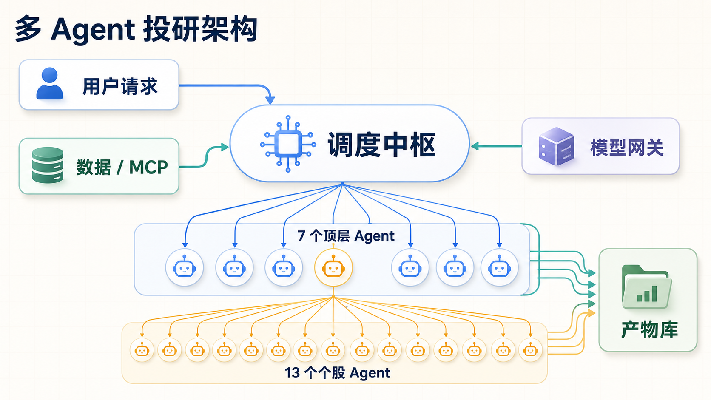
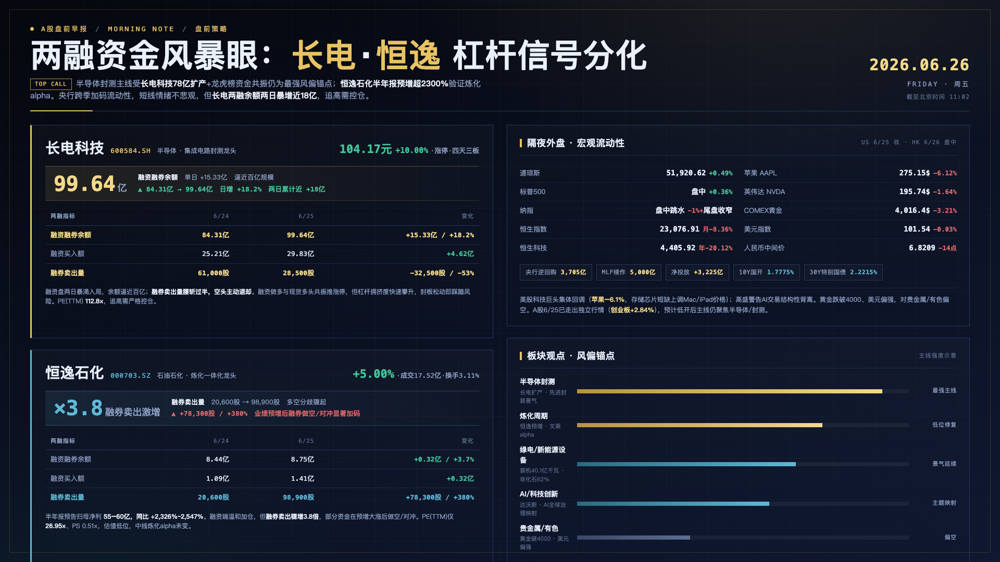
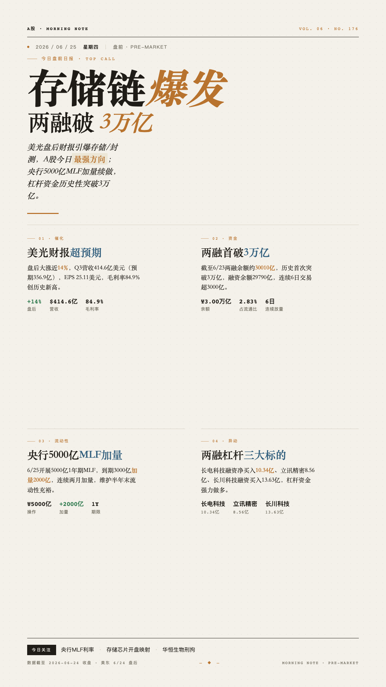

# Deep Financial Analysis

[English](README.en.md)

面向中国二级市场的多 Agent 投研系统。它把盘前信息、行业研究、股票筛选、个股研究、三表模型、DCF 估值和图表包串成一条本地可复盘的生产线。

> 免责声明：本项目生成的是投研工作底稿和分析材料，不构成投资建议。所有结论都应由具备资质的专业人士复核。

<p align="center">
  <br>
  <em>整体架构：调度中枢并发调用 7 个顶层 Agent，并展开 13 个个股覆盖 Agent。</em>
</p>

## 1. 这是一个什么项目

`Deep Financial Analysis` 是一个面向中国二级市场的本地投研工作流系统。它将中国市场投研工作拆成多个专业 agent，并让它们围绕同一个研究任务协作。

当前覆盖：

- 盘前晨报：隔夜市场、政策、公告、资金面和交易线索
- 行业研究：产业链、竞争格局、重点标的和风险变量
- 股票筛选：A 股 / 港股主题筛选、风格筛选和 watchlist
- 个股研究：公司研究、商业模式、成本结构、治理、护城河和风险
- 财务模型与估值：三表模型、模型审计、DCF、可比公司和估值调和
- 图表与报告：图表包、PPT/Markdown/HTML/PNG 研究材料和最终综合报告

数据层优先接入同花顺 iFind MCP；模型通过 OpenAI-compatible gateway 接入，默认 DashScope/Qwen，也可以替换。

## 2. 它能产出什么

| 产出 | 说明 |
|---|---|
| `morning-note.md` | A 股盘前晨报，覆盖海外市场、商品汇率、政策监管、公司事件和资金面 |
| 行业 / 主题报告 | 行业供需、价值链、竞争格局、A 股标的、催化因素和风险 |
| 股票筛选报告 | 主题、风格、资金或事件驱动下的候选股票和 watchlist |
| 个股研究报告 | 公司身份、业务拆分、利润驱动、治理、竞争优势和风险点 |
| `integrated_model.xlsx` | 三表联动模型、收入拆分、营运资本、PP&E、债务和 DCF inputs |
| 估值分析 | DCF、交易可比、历史倍数、市场隐含、估值调和和情景分析 |
| 图表包 | 估值足球场、敏感性分析、情景对比、风险矩阵、催化时间线等 |
| HTML 图片 | 基于 HTML Anything 风格模板渲染出的单页 PNG、卡片、海报、报告图和演示页 |

### 样例展示（HTML 图片渲染）

下面两张图是 `html_image_renderer` 基于 HTML Anything 风格模板渲染出的真实运行产物（PC 端单页 PNG）：

<p align="center">
  <br>
  <em>盘前两融资金主题 PC 头图：长电 · 恒逸 杠杆信号分化（2026-06-26）</em>
</p>

<p align="center">
  <br>
  <em>市场主题电子杂志风海报：存储链爆发 / 两融破 3 万亿（2026-06-24）</em>
</p>

## 3. 主要 Agent

当前项目按投研流程拆成多个可独立运行的 LangGraph agent，也可以通过顶层 orchestrator 串联执行：

| Agent | 入口 | 代表能力 |
|---|---|---|
| `deep_orchestrator` | `orchestrator/` | 分发投研任务、调度子 agent、汇总最终产出 |
| `morning_note` | `morning-note/` | 盘前晨报、政策公告、资金面和交易线索 |
| `market_researcher` / `sector_research` | `industry-ananlysis/`、`sector/` | 行业研究、主题研究、竞争格局和重点标的 |
| `stock_screen` | `screen/` | 股票筛选、watchlist 和事件驱动候选池 |
| `single_stock_coverage` | `single-stock-coverage/` | 个股研究、三表建模、DCF 估值、图表包和报告组装 |
| `dcf_builder` | `DCF-builder/` | DCF 假设研究、模型构建、估值调和和审计 |
| `html_image_renderer` | `html-image-renderer/` | 基于 HTML Anything 风格模板生成 HTML 并渲染单页 PNG |
| `thesis_tracker` | `thesis/` | 投资 thesis 跟踪、证据更新和观点复盘 |

## 4. 设计取舍：与 Anthropic Financial Agents 的区别

Anthropic 在 2026-05-05 发布了面向金融服务的 10 个 ready-to-run agent templates，覆盖投行、资管、财务和合规场景。官方资料见 [Agents for financial services](https://www.anthropic.com/news/finance-agents) 和 [anthropics/financial-services](https://github.com/anthropics/financial-services)。

Anthropic 的 Financial Agents 定位更接近“企业金融工作流模板市场”：包括 pitch builder、meeting preparer、earnings reviewer、market researcher、model builder、valuation reviewer、statement auditor、KYC screener 等，适合嵌入投行、审计、财务和合规流程。

`Deep Financial Analysis` 的出发点不同：它不是把一组 skills 拼起来，而是按中国二级市场投研流程组织。

| 维度 | Anthropic Financial Agents | Deep Financial Analysis |
|---|---|---|
| 定位 | 通用金融服务 agent templates | 面向中国二级市场的投研生产系统 |
| 平台依赖 | 主要依赖 Claude Cowork、Claude Code plugin 或 Managed Agents | 基于 Python、LangGraph 和本地文件系统；模型网关可替换 |
| 市场支持 | 偏全球金融机构通用流程 | 原生面向 A 股、港股、中概、中国宏观、公告、北向/南向、ETF、龙虎榜、期指和财报季 |
| 数据来源 | 侧重海外金融数据连接器和企业数据权限 | 已配置同花顺 iFind MCP，覆盖股票、基金、宏观、新闻、债券、全球股票和指数 |
| 投研逻辑 | 更像技能和模板集合 | 盘前 -> 行业/主题 -> 筛选 -> 个股研究 -> 三表 -> 估值 -> 图表/报告 |
| 产出形态 | 偏企业工作流和 Office 审阅 | 直接输出 Markdown、JSON、Excel、PPT、PNG 图表和最终综合报告 |
| 可复盘性 | 平台日志为主 | artifacts 全量落盘，包含 source log、run manifest、model audit、valuation state 等 |

简言之：Anthropic Financial Agents 更偏企业级通用金融模板；`Deep Financial Analysis` 更偏面向中国股票投研的完整本地工作流。

## 5. 配置方法

环境要求：

- Python 3.11
- OpenAI-compatible 模型网关，默认 `https://dashscope.aliyuncs.com/compatible-mode`
- 同花顺 iFind MCP token 或完整 Authorization header

安装：

```bash
python3.11 -m venv .venv
. .venv/bin/activate
pip install -U pip
pip install -e ./financial-agent-runtime \
  -e ./DCF-builder -e ./industry-ananlysis -e ./morning-note \
  -e ./screen -e ./sector -e ./thesis -e ./orchestrator \
  -e ./html-image-renderer -e ./single-stock-coverage
```

> `financial-agent-runtime` 是所有 agent 共用的运行时包，必须先安装，否则启动时会报
> `ModuleNotFoundError: No module named 'financial_agent_runtime'`。

配置：

```bash
cp .env.example .env
```

`.env` 中至少填写：

```bash
# model-routing.yaml 只保存 api_key_env 变量名；真实模型密码放在 .env。
DASHSCOPE_API_KEY=...
MINIMAX_API_KEY=...
ARK_API_KEY=...

# 二选一
IFIND_MCP_TOKEN=...
IFIND_MCP_AUTHORIZATION=Bearer ...

# 已有 iFind MCP 项目可选：东方财富妙想 MX DS MCP
MX_DS_MCP_API_KEY=...
```

可以用本地配置页编辑模型 profile、`api_key_env` 变量名和 agent/subagent 绑定：

```bash
.venv/bin/python -m financial_agent_runtime.model_admin
```

打开 `http://127.0.0.1:8765`，保存后会更新根目录 `model-routing.yaml`。
`model-routing.yaml` 已入库，只保存模型 profile、agent 绑定和 `api_key_env` 变量名，不保存真实密钥。

同花顺 iFind MCP URL 统一写在根目录 `tool-concurrency.yaml` 的 `mcp_servers`：

| Server | URL |
|---|---|
| `ifind-stock` | `https://api-mcp.51ifind.com:8643/ds-mcp-servers/hexin-ifind-ds-stock-mcp` |
| `ifind-fund` | `https://api-mcp.51ifind.com:8643/ds-mcp-servers/hexin-ifind-ds-fund-mcp` |
| `ifind-edb` | `https://api-mcp.51ifind.com:8643/ds-mcp-servers/hexin-ifind-ds-edb-mcp` |
| `ifind-news` | `https://api-mcp.51ifind.com:8643/ds-mcp-servers/hexin-ifind-ds-news-mcp` |
| `ifind-bond` | `https://api-mcp.51ifind.com:8643/ds-mcp-servers/hexin-ifind-ds-bond-mcp` |
| `ifind-global-stock` | `https://api-mcp.51ifind.com:8643/ds-mcp-servers/hexin-ifind-ds-global-stock-mcp` |
| `ifind-index` | `https://api-mcp.51ifind.com:8643/ds-mcp-servers/hexin-ifind-ds-index-mcp` |

东方财富妙想 MX DS MCP 也统一写在根目录 `tool-concurrency.yaml`：

| Server | URL |
|---|---|
| `mx-ds-mcp` | `https://mxapi.eastmoney.com/mxds/mcp` |

`mx-ds-mcp` 使用 `.env` 中的 `MX_DS_MCP_API_KEY` 作为 `em_api_key` header。根目录 `tool-concurrency.yaml` 还统一保存 `agent_configs`、`tool_groups` 和 `agent_tools`，包括每个 agent/subagent 可见的 MCP、本地工具、搜索默认值和输出目录。

外部工具并发限制也写在工作区根目录的 `tool-concurrency.yaml`。该文件同时保存 agent/subagent 工具授权，请保留；其中 `groups` 是共享并发配额：当组内在途调用数达到 `max_concurrency`，后续调用排队串行执行。默认把所有 `ifind-*` 归为一个 `ifind` 组（上限 5），把 `mx-ds-mcp` 归为独立的 `mx-ds` 组（上限 2），避免 orchestrator 并行派发多个子 agent 时打爆外部服务。可在该文件里改阈值、加 group，或用 `tools:` 通配符把具名工具（如 `web_search`）纳入同一配额；该限制是进程级共享的。缺少或清空 `groups` 只会关闭并发限制，不代表工具授权可缺省。

运行：

```bash
.venv/bin/langgraph dev
```

启动后可在 LangGraph 中选择顶层调度或单个投研 agent 运行；复合任务建议从 `deep_orchestrator` 开始。

### 运行模式：本地 / 云端沙箱

从 v0.2 起，系统支持两种文件后端，通过环境变量 `AGENT_BACKEND` 切换（默认 `local`）：

| 模式 | `AGENT_BACKEND` | 说明 |
|---|---|---|
| 本地模式 | `local`（默认） | 代码执行与产物读写都在本机文件系统完成（`LocalShellBackend` / `FilesystemBackend`），产物落到 `AGENT_FILE_STORAGE_ROOT`（留空则为本仓库工作区）。适合快速开发、调试和单机复盘。 |
| 云端模式（实验性） | `daytona` | 每个进程启动一个临时 [Daytona](https://www.daytona.io/) 云端沙箱，agent 的代码执行与产物写入都在沙箱内完成；产物根目录由 `DAYTONA_FILE_STORAGE_ROOT`（沙箱内的 Linux 路径）指定。适合隔离执行环境、统一 Linux 运行时、避免污染本机。 |

云端模式需要在 `.env` 中额外配置 Daytona 凭证：

```bash
AGENT_BACKEND=daytona
DAYTONA_API_KEY=...
DAYTONA_API_URL=https://app.daytona.io/api
DAYTONA_FILE_STORAGE_ROOT=/home/daytona/financial-analysis
```

两种模式共用同一套 agent 代码和 skills；切换后端不需要改动业务逻辑。

## 6. 当前版本、迭代方向和联系

当前版本：`v0.4.0 research-preview`，截至 2026-07-02。

完整版本历史见 [CHANGELOG.md](CHANGELOG.md)（English changelog: [CHANGELOG.en.md](CHANGELOG.en.md)）。

已具备：

- 顶层 orchestrator 和核心投研 agent
- 本地 / 云端（Daytona 沙箱）两种运行后端，通过 `AGENT_BACKEND` 切换
- 根级 `model-routing.yaml` 模型路由和本地模型配置管理页
- 根级 `tool-concurrency.yaml` 工具授权、MCP 配置和外部工具并发限制
- 同花顺 iFind MCP 统一数据接入
- 晨报、行业研究、资金扫描、公告扫描、个股研究、三表模型、DCF 和图表包
- 本地 Markdown / JSON / Excel / PPT / HTML / PNG artifacts 输出
- HTML 图片渲染 agent，可把既有研究材料转成单页视觉稿

致谢：

- HTML 图片渲染能力参考并使用了 [HTML Anything](https://github.com/nexu-io/html-anything) 项目的模板和 agentic HTML 工作流。

下一步：

- 完善个股研究最终报告
- 稳定股票筛选和 watchlist 解释
- 标准化 source log、引用和公开样例库
- 增加组合跟踪、回测和投资逻辑 scorecard 自动更新

联系：

- 邮箱：huang.shengsong1@gmail.com
- 问题和需求：请在当前项目提交 issue
